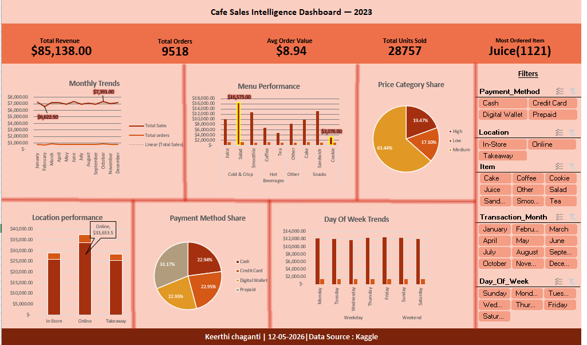

# Café Sales Intelligence & Advanced Excel Diagnostic Analytics-2023
Source:Kaggle

## Project Overview
This project delivers an end-to-end data engineering and diagnostic analytics solution built entirely inside **Microsoft Excel**. Working with an annual cafe sales dataset covering **9,518 unique orders**, the project lifecycle handles data ingestion and extraction using Power Query (ETL), statistical optimization through the Excel Data Analysis Toolpak, and dynamic, executive-facing visual reporting.

The primary objective is to isolate core revenue engines, evaluate demand volatility, and scientifically validate operational categories to maximize operational and margin efficiency.

---

## 1. Advanced Excel Technical Stack & Skills Demonstrated
* **ETL & Data Engineering:** Power Query for data profiling, handling hidden formatting gaps, and merging categorical fields.
* **Feature Engineering:** Advanced conditional nesting logic (`IF`, `IFS`, `XLOOKUP`) used to build time-intelligent dimensions (`Day_Type`).
* **Statistical Modeling:** Excel Data Analysis Toolpak implementation for parametric hypothesis testing (Single-Factor ANOVA and Two-Sample t-Tests assuming unequal variances).
* **Dynamic Visualization:** Interactive Excel dashboard design utilizing advanced slicer routing, dynamic pivot connections, and KPI card mapping.

---

## 2. Executive Summary & Core KPIs
The café's annual footprint across **9,518 individual transactions** generated a total top-line revenue of **\$85,138.00**. 

* **Total Revenue:** \$85,138.00
* **Total Transaction Volume:** 9,518 orders
* **Average Order Value (AOV / Mean):** \$8.94
* **Median Transaction Value:** \$8.00
* **Total Units Sold:** 28,757 units
* **Daily Sales Baseline:** \$233.25 / day
* **Top Velocity Product:** Juice (1,121 total orders)
* **Macro Revenue Peak:** October (\$7,391.00)
* **Macro Revenue Lull:** February (\$6,622.50)

---

## 3. Interactive Analytics Dashboard
To translate data metrics into dynamic operational control, an interactive sales intelligence dashboard was engineered. This interactive canvas serves as the primary visual interface for executive stakeholders.

### Interactive Components & Slicer Connections
* **Executive KPI Tiles:** Summary blocks linked directly to pivot tables display values for Revenue, Orders, AOV, Total Units, and Top Velocity items.
* **Multi-Dimensional Pivot Slicers:** Connected across multiple matrix cards on the sheet, enabling stakeholders to filter the layout instantly by:
  * *Payment Method:* Cash, Credit Card, Digital Wallet, Prepaid
  * *Fulfillment Location:* In-Store, Online, Takeaway
  * *Menu Item Selectors:* Tracking for all food/beverage classifications
  * *Temporal Filters:* Filtering by Month and Day of the Week

### Dashboard Preview

---

## 4. Statistical Distribution & Outlier Diagnostics
An evaluation of transaction dispersion reveals critical pricing boundaries and purchase patterns:

* **Core Spread:** Transactions range from a strict minimum of \$1.00 to a maximum ceiling of \$25.00.
* **Volatility Profile:** The standard deviation sits at **5.87** with a Coefficient of Variation (CV) of **65.61%**. This indicates a moderate-to-high variation in cart sizes, proving that revenue is highly sensitive to customer menu selections rather than flat-rate entry costs.
* **Skewness Metric:** The skewness calculation returns **0.81**, establishing a **Log-Normal / Right-Skewed distribution**. This mathematically confirms that while the majority of customers purchase lower-cost routine items, a consistent volume of premium or bulk orders stretches the revenue curve upward.
* **Outlier Boundary:** Using the Interquartile Range method (IQR=8) calculated via Excel formulas, the statistical upper outlier boundary is established at **\$24.00**. A total of **239 transactions (\$25.00)** sit as high-value outliers, representing 7% of total revenue.

---

## 5. Operational Performance Matrices
Performance was broken down across distinct operational dimensions using advanced Pivot Table segmentation:

### A. Revenue Performance Matrix
* **Product Categories:** **Salads** represent the premier cash engine, yielding **\$16,575.00**. Conversely, **Cookies** sit at the financial bottom, generating only **\$3,076.00**.
* **Temporal Cycles:** **October** marks the peak operational month (\$7,391.00), while **February** marks the lowest seasonal contraction (\$6,622.50).
* **Weekly Waves:** **Fridays** serve as the primary weekly revenue driver (\$12,453.00), whereas **Wednesdays** represent the lowest mid-week operational lull (\$11,673.50).

### B. Order Frequency & Volumetric Matrices
* **Velocity Leaders:** While Salads dominate raw money, **Juice** drives the highest transactional velocity with **1,121 unique orders**.
* **Physical Turnover:** **Coffee** represents the highest supply chain inventory movement, tracking **3,407 individual units sold**, making it the vital anchor for daily physical foot traffic.

---

## 6. Advanced Inferential Modeling (Data Analysis Toolpak)
To ensure business decisions are backed by statistical certainty rather than visual assumptions, multiple Single-Factor ANOVA tests and a Two-Sample t-Test were conducted inside Excel.

### A. Fulfillment Channel Variance (ANOVA)
* **Groups Evaluated:** In-Store, Online, Takeaway
* **Statistical Output:** F-Stat = 55.91, P-value = 0.00
* **Conclusion:** **Highly Significant.** Fulfillment method heavily influences order size. **Online orders** boast a commanding average of **\$92.20 per order**, vastly outpacing physical In-Store (\$71.36) and Takeaway (\$69.69) alternatives.

### B. Payment System Variance (ANOVA)
* **Groups Evaluated:** Cash, Credit Card, Digital Wallet, Prepaid
* **Statistical Output:** F-Stat = 45.81, P-value = 2.74 x 10^-28
* **Conclusion:** **Highly Significant.** **Prepaid accounts** yield a massive average order size of **\$72.70**, while Cash, Credit, and Digital Wallets remain perfectly flat, clustered tightly around **\$53.50**.

### C. Menu Mix Variance (ANOVA)
* **Groups Evaluated:** 9 Unique Menu Classifications
* **Statistical Output:** F-Stat = 155.15, P-value = 4.35 x 10^-222
* **Conclusion:** **Highly Significant.** Menu item variance is the single most powerful driver of order scale in the entire business ecosystem, led heavily by the high unit price of **Salads (\$45.41 average)**.

---

## 7. Day-Type Operational Elasticity & Normalization
To resolve uneven sample sizes across the year, a new categorical feature, `Day_Type` (Weekday vs. Weekend), was engineered via Power Query. Data was aggregated on a weekly basis across 52 balanced operational periods to execute an Excel **Two-Sample t-Test Assuming Unequal Variances**.

### t-Test Results Summary
* **Mean Weekly Weekday Revenue (5 days combined):** \$1,167.54
* **Mean Weekly Weekend Revenue (2 days combined):** \$466.29
* **Calculated t-Stat:** 37.78 (Critical Two-Tail threshold: 1.98)
* **Calculated P-value:** 5.21 x 10^-61

### The Normalization Discovery
Because the P-value sits infinitely below our standard alpha threshold ($p < 0.05$), we **reject the null hypothesis** with absolute statistical certainty. However, the deeper value comes from **Statistical Normalization**:

* **Normalized Daily Weekday Performance:** \$1,167.54 / 5 operating days = **\$233.51 / day**
* **Normalized Daily Weekend Performance:** \$466.29 / 2 operating days = **\$233.15 / day**

* **Conclusion:** The spending density and customer velocity per operating day are **virtually identical** between weekdays and weekends. The gross volume dominance of weekdays is purely a function of calendar duration (5 days vs. 2 days), proving that the café maintains incredibly stable consumer demand across all 7 days of the week.

---

## 8. Data-Driven Strategic Recommendations

1. **Scale the Prepaid Ecosystem:** Since Prepaid users buy significantly larger orders (\$72.70 vs. \$53.50), launch an aggressive loyalty or mobile app program offering a 5% bonus incentive for reloading prepaid accounts. This locks in customer loyalty and instantly scales up average order value.
2. **Optimize Digital Fulfillment Infrastructure:** Online orders are the premium revenue engine of the café, yielding the highest average transaction values (\$92.20). Management should allocate capital to refine the digital user experience, prioritize online order pickup lanes, and streamline mobile app interfaces to remove friction from this highly lucrative channel.
3. **Balanced Staffing Models:** Since the normalized daily revenue is practically identical on a Saturday compared to a Tuesday (\$233.15 vs. \$233.51), management should maintain consistent baseline staffing patterns across the entire week rather than drastically cutting personnel on weekends, ensuring service quality stays high during these shorter, high-density traffic windows.

---

## 9. Repository Protection & Replication Blueprint
To protect intellectual property and custom formula engineering, the companion workbook file `Cafe_Sales_Diagnostic_Model.xlsx` utilizes structured worksheet protection layouts. 

### Schema Verification Matrix
If you wish to test your own data against this analytical infrastructure, verify your data source mirrors the following configuration requirements:
* `Transaction_ID` (Text / Unique Key)
* `Item` (Text / Categorical Classification)
* `Quantity` (Integer / Product Volume)
* `Price_Per_Unit` (Decimal / Item Valuation)
* `Total_Spent` (Decimal / Derived Revenue Metric)
* `Payment_Method` (Text / Settlement Type)
* `Location` (Text / Inbound Channel Category)
* `Transaction_Date` (Date Field / Temporal Attribute)
